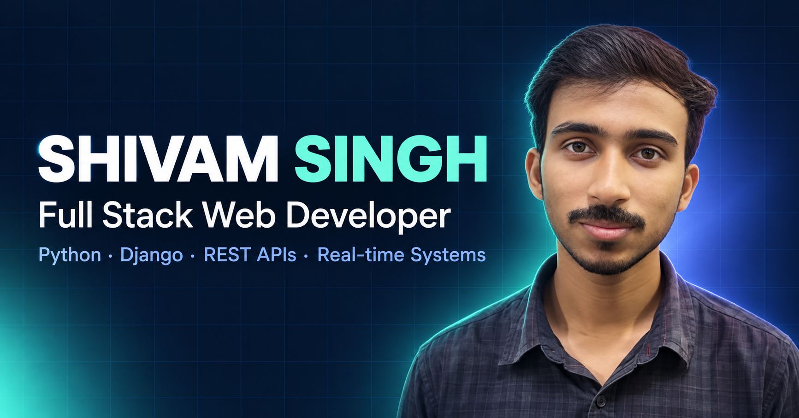

<p align="center">
  
</p>

<h1 align="center">👋 Hi, I'm Shivam Singh</h1>

<p align="center">
  <strong>Full Stack Web Developer | Python & Django Developer</strong>
</p>

<p align="center">
  📍 Patna, Bihar, India &nbsp; • &nbsp;
  💼 3+ Years Experience &nbsp; • &nbsp;
  🐍 Python & Django
</p>

<p align="center">
  <a href="mailto:shivamsingh.dev03@gmail.com">📧 Work With Me</a>
  &nbsp; • &nbsp;
  <a href="https://www.linkedin.com/in/shivam-singh-coder/">LinkedIn</a>
  &nbsp; • &nbsp;
  <a href="https://github.com/Shivam-Singh-Coder">GitHub</a>
  &nbsp; • &nbsp;
  <a href="https://shivam-singh-coder.github.io/shivam-singh-coder/">Portfolio</a>
</p>

<p align="center">
  
</p>

---

## 🚀 About Me

I'm a **Full Stack Web Developer / Python Django Developer** with 3+ years of professional experience building REST APIs, real-time systems, and scalable web applications.

Currently working at **Rays Edutech Private Limited**, where I develop and maintain production web applications using **Python, Django, Django REST Framework, MySQL, JavaScript, and related technologies**.

My core areas of expertise include:

- 🐍 Python & Django development
- 🔌 REST API development with Django REST Framework
- 🔐 JWT & custom token authentication
- 👥 Role-Based Access Control (RBAC)
- ⚙️ Custom decorators and middleware
- 💬 Real-time applications using Django Channels & WebSockets
- 🗄️ MySQL database design and query optimization
- 🎨 Full-stack web development
- 🚀 Production application development and optimization

I'm currently pursuing an **MCA in Artificial Intelligence & Machine Learning at Lovely Professional University**.

---

## 🛠️ Technical Skills

### 🐍 Backend Development


### 🎨 Frontend Development


### 🔐 Authentication & Security


- JWT Authentication
- Custom Token Authentication
- Role-Based Access Control (RBAC)
- Client-defined Privileges
- Custom Decorators
- Custom Middleware

### 💬 Real-Time Development

- Django Channels
- WebSockets
- Real-time Chat
- Real-time Notifications
- Concurrent user handling

### 🗄️ Database


### 🔧 Development Tools


---

## 💼 Professional Experience

### Full Stack / Backend Developer

**Rays Edutech Private Limited, Patna**  
`2024 – Present`

- Developed and deployed **50+ REST APIs** using Django and Django REST Framework.
- Improved API response time by approximately **30%**.
- Built applications supporting **1,000+ daily users**.
- Implemented **JWT, custom token authentication, and RBAC**.
- Developed real-time chat and notification functionality using **Django Channels and WebSockets**.
- Built reusable **decorators and middleware** for validation and permission management.
- Optimized **MySQL schemas and queries** for improved application performance.
- Worked across backend and frontend components of production applications.

### Full Stack Development Intern

**Rays Edutech Private Limited, Patna**  
`2023 – 2024`

- Worked on full-stack applications using **Django, Python, HTML, CSS, and JavaScript**.
- Contributed to **5+ client projects**.
- Developed responsive UI components and integrated frontend functionality with backend systems.

---

## 📂 Featured Projects

### 📚 [TestDarpan](https://testdarpan.com/)

**Online Test & Assessment Platform**  
**Role:** Full Stack Developer

Developed an online examination and assessment platform featuring:

- Question bank management
- Content creation with integrated text editor
- Online test functionality
- Automated evaluation
- Performance analytics
- Secure payment gateway integration

**Tech Stack:**  
`Python` `Django` `Django REST Framework` `MySQL` `HTML5` `CSS3` `JavaScript` `jQuery` `Bootstrap` `SMTP`

---

### 📊 [TrueSurvey](https://truesurvey.in/)

**Survey & Analytics Platform**  
**Role:** Backend Developer

Built backend functionality for a survey and public feedback platform supporting:

- Politician feedback
- Issue reporting
- Real-time public and constituency chats
- Survey data handling
- Real-time communication
- 500+ active users

**Tech Stack:**  
`Python` `Django` `Django REST Framework` `MySQL` `WebSockets`

---

### ⚙️ [Krishco Engineers Pvt. Ltd.](https://krishco.com/)

**ERP-like Manufacturing & Sales System**  
**Role:** Full Stack Developer

Developed an ERP-style system for manufacturing and sales operations, including:

- Product management
- QR and non-QR product tracking
- Manufacturing workflows
- Sales management
- Reporting
- Database-driven business operations

The system helped reduce manual tracking errors by approximately **40%**.

**Tech Stack:**  
`Python` `Django` `MySQL` `HTML5` `CSS3` `JavaScript` `Bootstrap`

---

### 🎓 [CollegeSewa](https://collegesewa.com/)

**Admission Management Portal**  
**Role:** Full Stack Developer

Developed functionality for an admission management platform handling:

- University and program listings
- Student registration
- Admission applications
- Lead generation
- Enquiry management
- 1,000+ applications

**Tech Stack:**  
`Python` `Django` `Django REST Framework` `MySQL` `HTML5` `CSS3` `JavaScript` `Bootstrap`

---

## ⚡ Core Django Expertise

```text
Python
│
└── Django
    │
    ├── Django REST Framework
    │   ├── REST APIs
    │   ├── Serializers
    │   ├── Authentication
    │   ├── Permissions
    │   ├── Pagination
    │   └── API Development
    │
    ├── Authentication & Authorization
    │   ├── JWT
    │   ├── Custom Token Authentication
    │   └── RBAC
    │
    ├── Custom Architecture
    │   ├── Custom Middleware
    │   ├── Custom Decorators
    │   └── Client-defined Privileges
    │
    ├── Real-Time Systems
    │   ├── Django Channels
    │   ├── WebSockets
    │   ├── Chat
    │   └── Notifications
    │
    └── Database
        ├── MySQL
        ├── Query Optimization
        └── Schema Optimization
```

---

## 🧑‍💻 GitHub

The previous README used third-party dynamic image services for GitHub stats, contribution graphs, and repository cards. Those services can become unavailable or rate-limited, which causes broken images on GitHub.

This version uses normal GitHub links instead, so the section remains reliable.

- 👤 **GitHub Profile:** [Shivam-Singh-Coder](https://github.com/Shivam-Singh-Coder)
- 💻 **RaysApp – Java Desktop Application:** [RaysApp-JAVA](https://github.com/Shivam-Singh-Coder/RaysApp-JAVA)
- 📌 **GitHub Profile Repository:** [Shivam-Singh-Coder](https://github.com/Shivam-Singh-Coder/Shivam-Singh-Coder)
- 📈 **Contributions & Activity:** [View GitHub Activity](https://github.com/Shivam-Singh-Coder?tab=overview)

---

## 🎓 Education

### Master of Computer Applications

**Artificial Intelligence & Machine Learning**  
Lovely Professional University  
`2025 – 2027`

### Bachelor of Computer Applications

**Chandigarh University**  
`81.20%` | `2022 – 2025`

### Intermediate in Science

**Manasthali Education Centre**  
`86.60%` | `2018 – 2020`

### Matriculation

**Manasthali Education Centre**  
`81.20%` | `2018`

---

## 📜 Certifications

- 🏆 **Data Science Workshop** – IIT Patna
- 🏆 **Full Stack Web Development** – Rays Edutech Pvt. Ltd.
- 🏆 **ADCA** – Rays Edutech Pvt. Ltd.

---

## 📫 Connect With Me

<p align="center">
  <a href="https://www.linkedin.com/in/shivam-singh-coder/">
    
  </a>
  <a href="https://github.com/Shivam-Singh-Coder">
    
  </a>
  <a href="https://shivam-singh-coder.github.io/shivam-singh-coder/">
    
  </a>
  <a href="mailto:shivamsingh.dev03@gmail.com">
    
  </a>
</p>

<p align="center">
  📧 <strong>shivamsingh.dev03@gmail.com</strong>
  <br />
  📱 <strong>+91 7617839389</strong>
</p>

---

<p align="center">
  <i>Code. Learn. Build. Repeat.</i> 🚀
</p>
